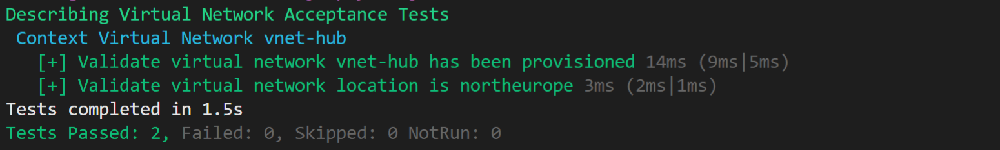

# AzPester

AzPester is a superset framework built on top of [Pester](https://github.com/pester/Pester) to validate Azure environments. You have just to define your target infrastucture using a json definition file and AzPester will evaluate if your cloud environment is alligned.

AzPester will only read Azure resource. No change can be made.  

## Requirements

- PowerShell 7.1 (version >= 7.1.3)
  - [Installing various versions of PowerShell](https://docs.microsoft.com/en-us/powershell/scripting/install/installing-powershell?view=powershell-7.1)
- Powershell Modules:
  - Az (version >= 5.8.0)
  - Az.ManagedServiceIdentity (version >= 0.7.3)
  - Pester (version >= 5.1.1)

Note: Version requirements reflects our development environment installation. It can probably work with earlier versions but has not been tested.

## Installation

```powershell
Set-PSRepository -Name "PSGallery" -InstallationPolicy Trusted
Find-Module -Name Az | Install-Module -Scope CurrentUser
Find-Module -Name Az.ManagedServiceIdentity | Install-Module -Scope CurrentUser
Find-Module -Name Pester | Install-Module -Scope CurrentUser
```

And clone the repository.

```powershell
git clone https://github.com/dupuyjs/AzPester.git
```

This framework cannot be packaged as a standalone Powershell module as *.Tests.p1 files used by Pester should be located in a child repository from where you invoke `Invoke-AzPester` command.

## Usage

### Declare a definition file

Update `subscriptionId` and `resourceGroupName` with appropriate values.

```json
{
    "$schema": "../../Source/Schemas/2021-04/schema.definition.json",
    "contentVersion": "1.0.0.0",
    "contexts": {
        "default": {
            "subscriptionId": "__SUBSCRIPTION_ID__",
            "resourceGroupName": "__RESOURCE_GROUP_NAME__"
        }
    },
    "definition": {
        "network": {
            "virtualNetworks": [
                {
                    "name": "vnet-hub",
                    "location": "northeurope"
                }
            ]
        }
    }
}
```

### Invoke AzPester using the definition file

```powershell
PS C:\AzPester> Import-Module .\Source\AzPester.psm1
PS C:\AzPester> Connect-AzAccount 
PS C:\AzPester> Invoke-AzPester -Definition definition.json
```


